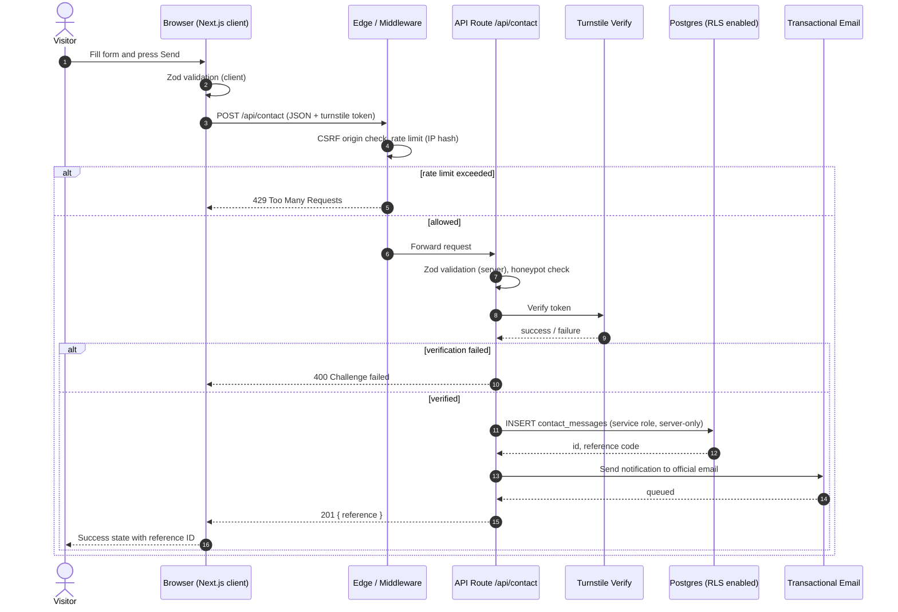
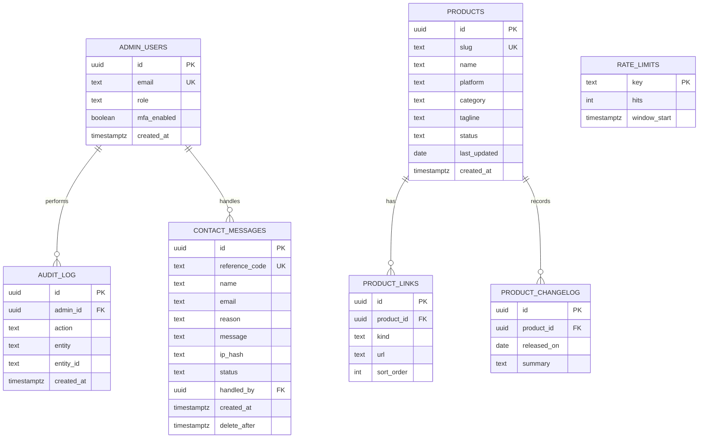

# PRD — HM Tech Innovation Corporate Website

> Document status: v1.0 · Owner: Haidir Magribi (Founder) · Audience: Coding AI Agent + Founder
> Companion document: `UI_SPEC.md` (visual system, mandatory reading)

---

## 1. Overview

### 1.1 Background
HM Tech Innovation is an independent, founder-led software company based in Samarinda, East Kalimantan, Indonesia. It designs, builds, and operates small, focused software products (micro-SaaS) delivered as Android apps on Google Play and as web applications. The company started as one person and is deliberately growing product by product, with each product aimed at one concrete, everyday problem.

### 1.2 Live Product Portfolio (verified facts only)

| Product | Platform | What it does | Monetization | Public URL |
|---|---|---|---|---|
| **AsapRadar** | Android (Google Play) | Daily morning air-quality (ISPU) briefing, haze and fire-hotspot radar projected onto the user's commute route, one-tap rider reports. No account, no ads, no analytics SDK. Independent, not affiliated with any government agency. | Free briefing; optional AsapRadar Plus at Rp 10,000/month (up to 5 routes, fire alerts within 5 km of a route) | `https://play.google.com/store/apps/details?id=id.asapradar.app` |
| **FlagCheck** | Android (Google Play) | AI chat-screenshot analyzer: hidden meaning, red flags, effort balance, three reply drafts in the user's own texting style, and scam/fraud pattern warnings (always free). Screenshots are never stored. EN / ID / ES. | One free analysis per day; Weekly Pro subscription; 10-Scan Pack (one-time) | `https://play.google.com/store/apps/details?id=app.flagcheck.mobile` |
| **AO Mart (Agen Organik)** | Web (e-commerce storefront) | Online storefront for an organic and gluten-free minimarket in Samarinda: browse by category, order without an account, coordinate delivery or pickup via WhatsApp. | Product sales | `https://agenorganik.com/` |

### 1.3 Core Problem the Website Solves
1. **Credibility gap:** A solo-founder company is invisible to partners, platforms, and programs without a single authoritative, verifiable home on the web.
2. **Fragmented proof:** Product evidence is scattered across Play Store listings, separate legal sites, and a storefront. There is no single page connecting them to one legal entity and one accountable person.
3. **Verification friction:** Program reviewers (including startup-program and platform verifiers) need to confirm in under two minutes: who the company is, that it is real, that products are live, how to contact it, and how it treats user data.

### 1.4 Target Audience
- **Primary:** Reviewers and verifiers (startup programs, platform partners, payment and API providers) who must validate that the company is real and operating.
- **Secondary:** Prospective users arriving from search or referrals who want to understand the company behind an app before installing it.
- **Tertiary:** Potential collaborators, press, and early partners.

### 1.5 Value Proposition
"Small software for real problems. Built by one accountable person, shipped, and live today." The site proves this claim with links, dates, and policies instead of adjectives.

### 1.6 Main System Objectives
1. Establish HM Tech Innovation as a verifiable, real software company within a single page view.
2. Present all three live products with direct, working links to their primary stores.
3. Make contact and accountability unambiguous (named founder, location, official email).
4. Expose privacy and data-handling stance per product, honestly and specifically.
5. Provide a clean, fast, accessible, SEO-ready, bilingual-ready foundation (English default, Bahasa Indonesia ready) for future products.

### 1.7 Non-Goals (MVP)
- No user accounts, dashboards, or paid checkout on this site.
- No blog, CMS, or newsletter in v1.
- No fabricated metrics, testimonials, logos, or "as seen in" badges. Ever.

---

## 2. High-Level Requirements

### 2.1 Target Platforms
- **Web (responsive, mobile-first).** Breakpoints: 360, 768, 1024, 1440. Primary traffic expected from mobile in Indonesia, so the site must perform on mid-range Android over 4G.
- Installable PWA is out of scope for MVP.

### 2.2 Access Levels (RBAC)

| Role | Description | Capabilities |
|---|---|---|
| `visitor` (anonymous) | Any public visitor, reviewer, or user | View all public pages; submit the contact form (rate-limited, bot-checked) |
| `admin` (founder only) | Single privileged account | Read and mark contact messages; edit product records; view audit log |

There is no multi-tenancy. A single `admin` role is created via a seeded, MFA-protected account. No public sign-up route exists.

### 2.3 Data Input Methods
- Contact form (name, email, reason, message) validated with Zod on client and server.
- Product and company content managed as typed content files in the repository (MVP) with an optional `products` table for later admin editing.
- No file uploads from visitors.

### 2.4 Performance Benchmarks
| Metric | Target |
|---|---|
| Largest Contentful Paint (mobile, 4G) | ≤ 2.0 s |
| Cumulative Layout Shift | ≤ 0.05 |
| Interaction to Next Paint | ≤ 150 ms |
| Lighthouse Performance / Accessibility / Best Practices / SEO | ≥ 95 / 100 / 100 / 100 |
| JS shipped on the homepage | ≤ 90 KB gzipped |
| Time to first byte (edge-cached) | ≤ 200 ms |

### 2.5 Retention & Monetization Strategy
The website itself is not monetized. Its job is trust conversion:
- **Conversion goals:** (1) Click-through to a product store page, (2) contact form submission or email click, (3) visit to the Trust page.
- **Retention:** Fresh "last updated" dates per product, a visible changelog line, and a contact route that gets answered within 2 business days.
- **Measurement:** Privacy-respecting analytics only (cookieless, no cross-site tracking). Events: `product_link_click`, `contact_submit`, `trust_view`, `email_click`.

### 2.6 Accessibility, SEO, and i18n
- WCAG 2.2 AA minimum. Full keyboard navigation, visible focus rings, `prefers-reduced-motion` honored.
- Structured data: `Organization`, `WebSite`, `SoftwareApplication` (per Android app), `LocalBusiness` is NOT used for HM Tech (AO Mart is a separate storefront).
- `sitemap.xml`, `robots.txt`, canonical URLs, Open Graph and Twitter cards per page.
- English is the default language. Route structure is ready for `/id/` (Bahasa Indonesia) in a later phase.

### 2.7 Identity Consistency Requirements (verification-critical)
These are mandatory, and any mismatch weakens credibility:
1. **Legal and brand name** appears identically everywhere: "HM Tech Innovation".
2. **Official contact email:** `official@mrwealthai.com` is the founder-provided official address. ⚠ **Open decision:** Play Store listings currently show `hmtechinovation@gmail.com` (note the single "n" in "inovation"). Recommended: register a company domain (e.g., `hmtechinnovation.com` or similar), create `official@<company-domain>`, and update the Play Store developer contact, the website, and the legal pages to the same address. Until then, show `official@mrwealthai.com` as the primary and note the Play listing address on the Trust page so reviewers can reconcile both.
3. **Founder identity:** Haidir Magribi, Samarinda, East Kalimantan, Indonesia. Matches the Google Play developer profile.
4. **Product links** must open the exact production listings above.

---

## 3. Comprehensive Pages & Core Features Mapping

Route inventory: `/`, `/products`, `/products/asapradar`, `/products/flagcheck`, `/products/ao-mart`, `/about`, `/trust`, `/contact`, `/legal/privacy`, `/legal/terms`, `/404`, plus `POST /api/contact`.

### 3.1 `/` — Home

**Page Purpose:** Answer in one screen: who is HM Tech Innovation, what do they build, and is it real. Route visitors to products or the Trust page.

**Visual Components & Layout:**
1. **Top navigation (sticky, 56px):** wordmark left; links `Products`, `About`, `Trust`, `Contact`; right-aligned primary button `Email the founder`. Collapses to a full-height sheet menu below 768px.
2. **Hero (left-anchored, 12-col grid):** Headline, 2-line subcopy, two CTAs (`See live products`, `How we handle your data`). Right column: a "Live Registry" panel (see below). No centered floating void.
3. **Live Registry panel:** A bordered panel listing the three products as mono-typed rows: `PRODUCT / PLATFORM / STATUS / LAST UPDATED`, each row a link. Data from the products content file (AsapRadar: updated Oct 1, 2026; FlagCheck: updated Sep 10, 2026; AO Mart: live).
4. **Product strip:** Three product cards (see 3.2 anatomy) with real store badges.
5. **"How we build" section:** Four principles in a 2×2 grid: *One problem per product*, *No account unless essential*, *Plain data practices*, *Independent and accountable*. Each backed by a concrete example from the actual products (e.g., "AsapRadar: no account, no ads, no analytics SDK").
6. **Trust band:** Three facts: Based in Samarinda, Indonesia · Founder-operated · Products live on Google Play and the web. Link to `/trust`.
7. **Closing contact block:** Left-anchored, with email and short form teaser linking to `/contact`.
8. **Footer:** Company name, location, official email, product links, legal links, "© 2026 HM Tech Innovation".

**Detailed Feature Elements & User Actions:**
- Registry rows are fully clickable; keyboard focus shows a 2px accent outline.
- Hero CTA `See live products` smooth-scrolls to product strip (disabled when reduced motion is on, uses jump).
- Language chip (EN, `ID` disabled with tooltip "Coming soon") shown in the footer only.
- Every outbound store link carries `rel="noopener noreferrer"` and fires `product_link_click`.

**System & Backend Integration:**
- Static generation (SSG) with revalidation on deploy. Reads `content/products.ts`.
- No backend calls on load. Analytics events are posted to the cookieless analytics endpoint.

### 3.2 `/products` — Product Index

**Page Purpose:** One canonical list of everything the company has shipped.

**Visual Components & Layout:**
- Page header with count ("3 live products").
- Filter bar (left) with toggles: `All`, `Android`, `Web`. Sort: `Recently updated` (default), `Name`.
- Product card grid (1 col mobile, 2 col tablet, 3 col desktop).
- **Product card anatomy:** product icon (48px, 8px radius), name, one-line problem statement, mono metadata row (`PLATFORM · CATEGORY · UPDATED`), two buttons: `Details` (internal) and a store button (`Google Play` or `Visit site`). 1px border, no heavy shadow.

**Detailed Feature Elements & User Actions:**
- Filter toggles update the URL query (`?platform=android`) for shareable state and preserve scroll.
- Empty-filter state: "No products match this filter yet." with a `Reset filters` button.
- Cards show an `ANDROID` or `WEB` tag in mono caps.

**System & Backend Integration:**
- Reads `products` content. Filtering is client-side on a statically provided array. No API call.

### 3.3 `/products/asapradar` — AsapRadar Detail

**Page Purpose:** Explain AsapRadar precisely and honestly, and send the visitor to Google Play.

**Visual Components & Layout:**
1. Header: icon, name, tagline "Haze, ISPU air quality and fire alerts for your commute."
2. Primary CTA: `Get it on Google Play` (official badge usage per Google brand rules) and a mono line `Last updated Oct 1, 2026`.
3. **"What it tells you" block:** Example briefing strings rendered in a mono card ("Good air, safe without a mask." / "Unhealthy air, wear an N95.").
4. **Feature rows:** Morning Air Briefing (free), Haze and Fire Radar, Commuter route view, Rider Reports, AsapRadar Plus.
5. **Data Sources panel:** Linked list of official sources (ISPU, BMKG, NASA FIRMS, Copernicus CAMS, Open-Meteo, OpenAQ, BNPB).
6. **Disclaimer block (bordered, prominent):** "AsapRadar is not a government app and is not affiliated with Indonesia's Ministry of Environment, BMKG, BNPB, or any government agency. It is an estimation aid, not an official warning."
7. **Privacy facts (mono checklist):** No account · Location read only while app is open · Server keeps area rounded to ~11 km for the briefing · Reports and photos auto-deleted after 3 hours · No ads · No analytics SDK.
8. **Pricing line:** "AsapRadar Plus: Rp 10,000 per month. Renews through Google Play. Cancel any time."
9. Link to the app's own privacy policy (`https://asapradar.vercel.app/legal/privacy.html`).

**Detailed Feature Elements & User Actions:**
- Screenshot gallery uses Play Store screenshots hosted locally (optimized, `next/image`), keyboard-navigable, with alt text describing each screen.
- Anchor links to each section; copy-link button on section headings.

**System & Backend Integration:** SSG. `SoftwareApplication` JSON-LD with `applicationCategory: "NavigationApplication"` (matching "Maps & Navigation"), `operatingSystem: "Android"`.

### 3.4 `/products/flagcheck` — FlagCheck Detail

**Page Purpose:** Explain FlagCheck and its privacy design, and send the visitor to Google Play.

**Visual Components & Layout:**
1. Header: icon, name, tagline "Read between the lines of any chat."
2. Primary CTA: Google Play badge; mono line `Last updated Sep 10, 2026`.
3. **"What it reads" grid:** Hidden meaning line by line; Red flags and toxic patterns; Effort balance; Response score.
4. **"Who are you talking to" selector (static illustration):** Chips for crush / partner / ex / friend / work / stranger, illustrating that the reading changes by relationship.
5. **"Three replies" block:** Names the three draft types: sharp mirror, firm boundary, clean closure.
6. **Scam detection block (emphasized):** Lists the matched patterns (OTP requests, "my number changed", urgency plus secrecy, redirected payments, fake support). States: "Scam warnings are never behind a paywall. FlagCheck never declares someone a scammer. It names the patterns matched and tells you how to verify."
7. **Privacy facts:** No account · Blackout redaction burned into the image before upload · Screenshot never stored (server memory only, for the request) · Results saved on-device, erasable from Settings.
8. **Pricing:** One free analysis per day · Weekly Pro · 10-Scan Pack (one-time).
9. **"What this is not" block:** "Not a lie detector, not a diagnosis. A second opinion, never a verdict."
10. Languages: English, Bahasa Indonesia, Español. Link to `https://flagcheck-legal.vercel.app/privacy`.

**Detailed Feature Elements & User Actions:** Same gallery and anchor behavior as 3.3.

**System & Backend Integration:** SSG; `SoftwareApplication` JSON-LD with `applicationCategory: "CommunicationApplication"`.

### 3.5 `/products/ao-mart` — AO Mart (Agen Organik) Detail

**Page Purpose:** Present AO Mart as the company's web commerce product and link to the live storefront.

**Visual Components & Layout:**
1. Header: name, tagline "Healthy food, ordered the simple way."
2. CTA: `Visit agenorganik.com`.
3. Facts block: Organic grains and superfoods, gluten-free noodles and flour, non-MSG broth, pure honey, VCO and olive oil, daily groceries; order without an account; coordinate delivery or pickup via WhatsApp; physical store in Samarinda Kota; also on Shopee, Tokopedia, TikTok, Instagram.
4. "What we built" mono list (feature facts only): category browsing, cart, account-optional checkout, WhatsApp order handoff, return policy page.
5. Screenshot of the live storefront (static image).

**Detailed Feature Elements & User Actions:** External link opens in a new tab. A visible note states: "AO Mart is a retail storefront operated under the same founder."

**System & Backend Integration:** SSG. No `LocalBusiness` JSON-LD on this domain (belongs to the storefront itself).

### 3.6 `/about` — About

**Page Purpose:** Tell the real story, with the founder named.

**Visual Components & Layout:**
- Two-column: left, a short narrative; right, a "Company Facts" definition list (mono labels): `Company: HM Tech Innovation`, `Founder: Haidir Magribi`, `Based in: Samarinda, East Kalimantan, Indonesia`, `Model: Independent, founder-led micro-SaaS studio`, `Products live: 3`, `Contact: official email`.
- **Principles section:** The four build principles with concrete evidence.
- **Roadmap (honest, short):** "Now: operate and improve three live products. Next: ship additional micro-SaaS tools for everyday problems." No dates promised unless real.

**Detailed Feature Elements & User Actions:** `Copy email` button with toast confirmation; link to Trust page.

**System & Backend Integration:** SSG; `Organization` JSON-LD (name, url, email, founder, address locality and region, country).

### 3.7 `/trust` — Trust & Verification Center

**Page Purpose:** The page a reviewer opens first. Everything verifiable on one screen.

**Visual Components & Layout:**
1. **Verification checklist table** (mono): `Item | Evidence | Link`.
   - Legal identity and founder, Google Play developer profile, location.
   - Live products, with direct store links and last-updated dates.
   - Privacy policies, per-product links.
   - Official contact and response time.
   - Data practices summary per product (3 rows).
2. **"Contact consistency" note:** Lists every email address appearing on public listings and states which is primary.
3. **Downloadable fact sheet:** one-page PDF (generated at build) with company facts and links.
4. **Reviewer quick-links:** Row of buttons: `Play Store: AsapRadar`, `Play Store: FlagCheck`, `AO Mart`, `Email official`.

**Detailed Feature Elements & User Actions:** `Download fact sheet (PDF)` button; every row has a copy-link icon; print stylesheet produces a clean one-page output.

**System & Backend Integration:** SSG; the fact sheet is generated from the same content source to prevent drift.

### 3.8 `/contact` — Contact

**Page Purpose:** Fast, low-friction contact with clear expectations.

**Visual Components & Layout:**
- Left: direct email (mono, copyable), location, response-time promise ("Replies within 2 business days").
- Right: contact form in a bordered panel anchored to the grid.

**Detailed Feature Elements & User Actions:**
- Fields: `Name` (required), `Email` (required), `Reason` (select: Partnership, Press, Product support, Verification request, Other; default `Verification request` is NOT preselected, default is `Other`), `Message` (required, 20–2000 chars, live counter), hidden honeypot, Turnstile challenge.
- Inline validation on blur; submit button shows a progress-driven state (`Validating` → `Sending` → `Delivered`).
- Success state shows a reference ID in mono (`HM-2026-XXXXXX`) and a `Send another` button.
- Error states list the exact failing field; network failure offers `Copy message` and `Email directly`.

**System & Backend Integration:**
- `POST /api/contact` → Zod validation → Turnstile verify → rate-limit (5/hour/IP hash) → insert `contact_messages` → email notification via transactional email provider → return reference ID.

### 3.9 `/legal/privacy` and `/legal/terms`

**Page Purpose:** Honest, specific legal pages for the website itself, plus pointers to per-product policies.

**Visual Components & Layout:** Single readable column (max 68ch), sticky table of contents on desktop, "Last updated" mono stamp.

**Detailed Feature Elements & User Actions:** Section anchors; print stylesheet. Privacy page states precisely what the website collects (contact form data, cookieless aggregate analytics), retention (messages deleted after 12 months), and links to AsapRadar and FlagCheck policies.

**System & Backend Integration:** SSG from MDX files.

### 3.10 `/404`
Left-anchored message in mono (`404 · ROUTE NOT FOUND`), a list of valid routes as links, and a search-free path home.

---

## 4. User Flow & System Interaction

### 4.1 Flow A — Reviewer / Verifier (primary)
1. Lands on `/` from the application form or a shared link.
2. Reads hero and Live Registry; sees three products with dates.
3. Opens `/trust`; scans the checklist; opens product store links to confirm they are live.
4. Verifies the founder name and location match the Play developer profile.
5. Reads privacy facts; optionally downloads the fact sheet PDF.
6. Sends a verification question via `/contact` or emails directly. **Goal complete.**

### 4.2 Flow B — Prospective App User
1. Arrives from search at `/products/asapradar` or `/products/flagcheck`.
2. Reads what the app does and its privacy stance.
3. Clicks `Get it on Google Play`. **Goal complete.**

### 4.3 Flow C — Collaborator or Press
1. `/` → `/about` → `/contact` → submits form with reason `Partnership` or `Press`.
2. Receives a reference ID and a reply within 2 business days.

### 4.4 Cross-Page Data Flow Overview
- Single source of truth: `content/company.ts` and `content/products.ts` feed Home, Products, Product Detail, About, Trust, JSON-LD, sitemap, and the PDF fact sheet.
- Only one dynamic write path exists: `POST /api/contact`.
- Analytics events are anonymous and contain no PII.

---

## 5. Technical Architecture

### 5.1 Sequence Diagram: Contact Submission

### 5.2 Architecture Description
- **Rendering:** Next.js App Router with static generation for all content pages. Only `/api/contact` and analytics ingestion run as serverless/edge functions.
- **Content:** Typed TypeScript content modules plus MDX for legal pages. This keeps the site fast and removes a CMS attack surface.
- **Data:** A small Postgres instance for contact messages, rate-limit counters, and the admin audit log. Row Level Security is enabled on every table.
- **Hosting:** Vercel (already used by sibling product sites) with a custom domain, HTTPS-only, HSTS preload.
- **Email:** Transactional provider with SPF, DKIM, and DMARC configured for the official domain.
- **Observability:** Error tracking with PII scrubbing; uptime monitor on `/`, `/trust`, and `/api/health`.

---

## 6. Database Schema

### 6.1 ERD

### 6.2 Entity Dictionary

| Table | Column | Key | Purpose |
|---|---|---|---|
| `admin_users` | `id` | PK | Admin identity (founder only) |
| | `email` | UK | Login identifier |
| | `role` | | Fixed value `admin` |
| | `mfa_enabled` | | Must be true to access admin routes |
| `contact_messages` | `id` | PK | Row identifier |
| | `reference_code` | UK | Human-readable ID returned to sender (`HM-2026-XXXXXX`) |
| | `name`, `email`, `reason`, `message` | | Validated form payload |
| | `ip_hash` | | Salted hash for abuse control; raw IP never stored |
| | `status` | | `new`, `read`, `replied`, `spam` |
| | `handled_by` | FK → `admin_users.id` | Who processed it |
| | `delete_after` | | Retention deadline (created_at + 12 months) |
| `products` | `id` | PK | Product identifier |
| | `slug` | UK | URL segment |
| | `platform` | | `android` or `web` |
| | `status` | | `live`, `beta`, `retired` |
| | `last_updated` | | Shown publicly as a mono date |
| `product_links` | `product_id` | FK → `products.id` | Owning product |
| | `kind` | | `store`, `privacy`, `website`, `social` |
| | `url` | | Absolute HTTPS URL |
| `product_changelog` | `product_id` | FK | Owning product |
| | `released_on`, `summary` | | One-line public change entry |
| `rate_limits` | `key` | PK | Hashed IP + route |
| | `hits`, `window_start` | | Sliding-window counters |
| `audit_log` | `admin_id` | FK | Actor |
| | `action`, `entity`, `entity_id` | | Immutable record of admin actions |

**RLS policy summary:** `contact_messages`, `rate_limits`, and `audit_log` deny all access to anonymous and authenticated client roles; writes happen only through server-side service credentials. `products`, `product_links`, and `product_changelog` allow public `SELECT` only.

---

## 7. Design & Technical Constraints

- **Tech Stack Recommendation:**
  - **Frontend:** Next.js (App Router) + TypeScript (strict) + Tailwind CSS v4 + `next/image` + `next/font`.
  - **Backend:** Next.js route handlers (Node runtime for email, Edge for rate limiting), Zod for all validation.
  - **Database:** PostgreSQL (Supabase or Neon) with RLS.
  - **Email:** Resend (or equivalent) with SPF/DKIM/DMARC.
  - **Bot protection:** Cloudflare Turnstile.
  - **Analytics:** Cookieless, privacy-first analytics (Plausible or Vercel Analytics without cross-site identifiers).
  - **AI Engines:** None required on the site in MVP. If an AI assistant is added later, route all calls server-side with scoped keys.
  - **Testing:** Vitest (unit), Playwright (e2e + a11y via axe), Lighthouse CI in the deploy pipeline.
- **UI System Reference:** MANDATORY cross-reference to `UI_SPEC.md` for all frontend implementation details, including tokens, component anatomy, and the anti-slop blacklist.
- **Backend/AI Constraint:** REQUIRED use of the "Context7" documentation engine to pull the latest framework docs (Next.js, Tailwind, Zod, the database client, the email SDK) before writing or modifying any code that depends on them. Do not rely on memory for API signatures.
- **Typography Standards:**
  - Display/Sans: a high-contrast technical grotesque (e.g., "Geist", "Inter Tight", or "Instrument Sans"), self-hosted via `next/font`.
  - Mono: `JetBrains Mono, monospace` for all data, dates, IDs, reference codes, metrics, and registry rows.

---

## 8. MANDATORY AI AGENT EXECUTION PROTOCOL & WORKFLOW RULES

(Operational prompt directive for the Coding AI Agent executing this codebase.)

### RULE A: Specification Verification Strategy
1. Before writing any frontend code, the AI Agent MUST read and strictly adhere to both `PRD.md` (for business logic) and `UI_SPEC.md` (for visual styling and component anatomy).
2. If styling decisions conflict between default framework templates and `UI_SPEC.md`, `UI_SPEC.md` ALWAYS takes absolute precedence.
3. **Content Integrity Rule:** The agent MUST NOT invent metrics, user counts, ratings, testimonials, awards, partner logos, or company history. Only facts listed in this PRD may appear. If a fact is missing, insert a clearly marked `TODO(founder)` placeholder and log it in `tasks_todo.md`.

### RULE B: Task Management System (3-File Task Tracker)
To maintain laser focus and prevent hallucination, the AI Agent MUST initialize and strictly update three local markdown files:
1. `tasks_todo.md`: List of all upcoming granular tasks.
2. `tasks_running.md`: The single task currently being actively coded.
3. `tasks_done.md`: Archive of verified and completed tasks.

**TASK GRANULARITY RULES:**
- Maximum size per task: Exactly ONE Page/Screen OR ONE Backend API Service.
- Granular sub-tasks required for complex multi-state interfaces (e.g., the contact form: idle, validating, sending, success, error, rate-limited).
- **LIFECYCLE:** Move tasks from `tasks_todo.md` → `tasks_running.md` → `tasks_done.md`. Every status shift MUST be logged in real time with a timestamp.

**Initial task backlog (seed `tasks_todo.md` with exactly these):**
1. Global layout: nav, footer, tokens, fonts
2. `/` Home
3. `/products` Index
4. `/products/asapradar`
5. `/products/flagcheck`
6. `/products/ao-mart`
7. `/about`
8. `/trust` (+ fact sheet PDF generator)
9. `/contact` (UI, all six states)
10. `/legal/privacy` and `/legal/terms`
11. `/404`
12. API: `POST /api/contact`
13. API: analytics ingestion + `/api/health`
14. SEO: JSON-LD, sitemap, robots, OG images
15. Accessibility and performance audit pass

### RULE C: Execution Sequence (Frontend-First to Framework to Backend)
The AI Agent MUST follow this exact 3-step development pipeline:
1. **PHASE 1 (Pure HTML Prototype):** Build raw, clean HTML/CSS layout prototypes first for every page. Present these to the user to confirm layout, ergonomics, and component placement.
2. **PHASE 2 (Framework Conversion):** Once approved, convert HTML files into Next.js components using the tokens in `UI_SPEC.md`.
3. **PHASE 3 (Backend & API Integration):** Only after frontend components are fully rendered in the chosen framework should backend routes, databases, and APIs be connected.

### RULE D: Security Standard Protocols (ISO 27001 Compliance)
- Implement ISO/IEC 27001 aligned security practices (Strict Access Control, Least Privilege Principle, Zero Trust Data Access).
- Enforce Input Validation (Zod schemas), CSRF Protection (origin and token checks), Rate Limiting, and Role-Based Access Control (RBAC).
- Secrets MUST NOT be exposed to client-side code or committed; use encrypted environment variables. Only `NEXT_PUBLIC_`-prefixed non-secret values may reach the client.
- Enforce Row Level Security (RLS) or strictly scoped database middleware policies on every table.
- Security headers: strict CSP (no inline script without nonce), HSTS, `X-Content-Type-Options`, `Referrer-Policy: strict-origin-when-cross-origin`, `Permissions-Policy` locked down.
- Store only salted hashes of IP addresses. Define and implement retention (contact messages deleted after 12 months).
- Dependency hygiene: lockfile committed, automated dependency audit in CI.